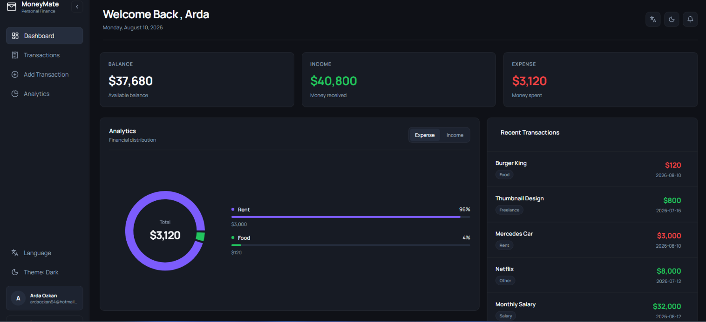
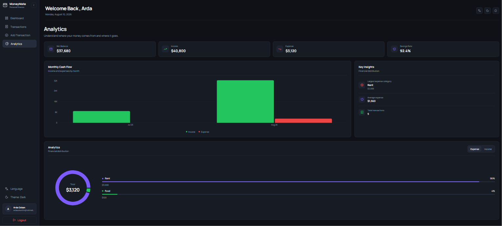
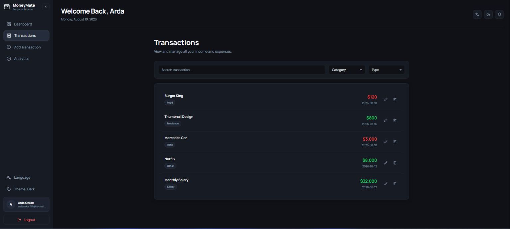
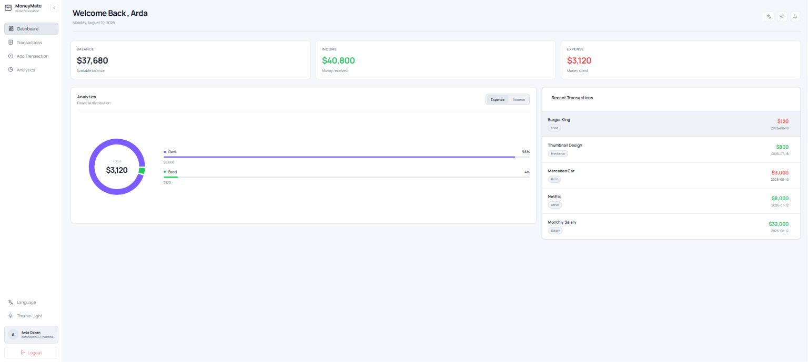
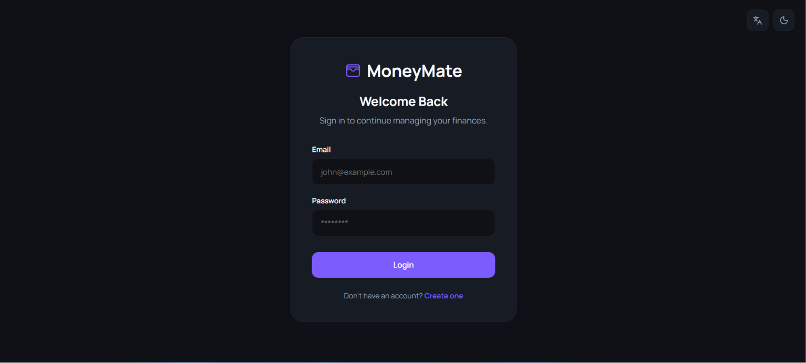

# MoneyMate

<div align="center">
  <h3>A modern personal finance dashboard for everyday money management.</h3>
  <p>
    Track income and expenses, understand spending habits, and manage your
    transactions from a clean, responsive interface.
  </p>
</div>

<p align="center">
  
</p>

## Overview

MoneyMate is a personal finance web application built with React and Firebase.
It provides secure user accounts, cloud persistence, transaction
management, and visual financial insights in one place.

The interface supports English and Turkish, includes light and dark themes,
and is designed to work across desktop and mobile screen sizes.

## Features

- Email and password authentication with Firebase Authentication
- Protected application routes for signed-in users
- Add, edit, delete, search, and filter financial transactions
- Income, expense, and balance summary cards
- Category-based income and expense distribution charts
- Dedicated analytics page with:
  - Monthly income and expense comparison
  - Net balance and savings rate
  - Largest expense category
  - Average expense and total transaction insights
- English and Turkish interface support
- Persistent light and dark theme preferences
- Skeleton loading states and empty-state guidance
- Pagination and confirmation dialogs
- Responsive layout for desktop, tablet, and mobile devices
- Toast notifications for important actions

## Screenshots

<table>
  <tr>
    <td width="50%" align="center"><strong>Financial Analytics</strong></td>
    <td width="50%" align="center"><strong>Transaction Management</strong></td>
  </tr>
  <tr>
    <td>
      
    </td>
    <td>
      
    </td>
  </tr>
  <tr>
    <td width="50%" align="center"><strong>Light Theme</strong></td>
    <td width="50%" align="center"><strong>Authentication</strong></td>
  </tr>
  <tr>
    <td>
      
    </td>
    <td>
      
    </td>
  </tr>
</table>

## Tech Stack

| Category | Technology |
| --- | --- |
| Frontend | React 19, JavaScript, CSS |
| Build tool | Vite 8 |
| Routing | React Router |
| Authentication | Firebase Authentication |
| Database | Cloud Firestore |
| Charts | Recharts |
| Icons | Lucide React, React Icons |
| Notifications | Sonner |
| Code quality | ESLint, Prettier |

## Getting Started

### Prerequisites

Make sure the following tools are installed:

- [Node.js](https://nodejs.org/) 20.19+ or 22.12+
- npm
- A [Firebase](https://firebase.google.com/) project

### Installation

Clone the repository and install the dependencies:

```bash
git clone https://github.com/Ardaozk54/MoneyMate.git
cd MoneyMate
npm install
```

### Firebase Setup

1. Create a project in the [Firebase Console](https://console.firebase.google.com/).
2. Add a Web app to the Firebase project.
3. Enable **Email/Password** under **Authentication > Sign-in method**.
4. Create a **Cloud Firestore** database.
5. Copy the Web app configuration into `src/firebase/firebase.js`:

```js
const firebaseConfig = {
  apiKey: "YOUR_API_KEY",
  authDomain: "YOUR_PROJECT.firebaseapp.com",
  projectId: "YOUR_PROJECT_ID",
  storageBucket: "YOUR_PROJECT.firebasestorage.app",
  messagingSenderId: "YOUR_MESSAGING_SENDER_ID",
  appId: "YOUR_APP_ID",
};
```

The `transactions` collection is populated automatically when a signed-in user
creates their first transaction.

### Firestore Security

Before deploying the application, configure Firestore rules so users can only
access their own transactions. The following is a suitable starting point:

```text
rules_version = '2';

service cloud.firestore {
  match /databases/{database}/documents {
    match /transactions/{transactionId} {
      allow create: if request.auth != null
        && request.resource.data.userId == request.auth.uid;

      allow read, delete: if request.auth != null
        && resource.data.userId == request.auth.uid;

      allow update: if request.auth != null
        && resource.data.userId == request.auth.uid
        && request.resource.data.userId == request.auth.uid;
    }
  }
}
```

Review and adapt these rules to match your production requirements before
publishing the app.

### Run Locally

Start the Vite development server:

```bash
npm run dev
```

Open the URL shown in the terminal, usually
[`http://localhost:5173`](http://localhost:5173).

## Available Scripts

| Command | Description |
| --- | --- |
| `npm run dev` | Starts the local development server |
| `npm run build` | Creates an optimized production build |
| `npm run preview` | Serves the production build locally |
| `npm run lint` | Runs ESLint across the project |

## Project Structure

```text
src/
├── components/       Reusable UI, charts, forms, settings, and skeletons
├── constants/        Categories and initial form values
├── context/          Authentication, transactions, theme, and language state
├── firebase/         Firebase application configuration
├── i18n/             English and Turkish translations
├── layouts/          Shared authenticated application layout
├── pages/            Dashboard, transactions, analytics, and auth pages
├── services/         Firebase authentication and Firestore operations
├── utils/            Finance, chart, transaction, and validation helpers
├── App.jsx            Routes and application-level UI
└── main.jsx           React application entry point
```

## Main Routes

| Route | Purpose |
| --- | --- |
| `/` | Financial dashboard and recent transactions |
| `/transactions` | Search, filter, edit, and delete transactions |
| `/add-transactions` | Create a new transaction |
| `/edit-transaction/:id` | Update an existing transaction |
| `/analytics` | Monthly trends, category distribution, and insights |
| `/login` | Sign in to an existing account |
| `/register` | Create a new account |

## Data Model

Each Firestore transaction document uses the following structure:

```js
{
  userId: "firebase-user-id",
  title: "Monthly Rent",
  category: "RENT",
  amount: 950,
  type: "expense",
  date: "2026-08-10",
  createdAt: serverTimestamp()
}
```

## Deployment

Create a production build with:

```bash
npm run build
```

The generated `dist` directory can be deployed to services such as Vercel,
Netlify, Cloudflare Pages, or Firebase Hosting. Configure all routes to fall
back to `index.html` so React Router can handle client-side navigation.

## Contributing

Contributions are welcome. Fork the repository, create a focused branch, and
open a pull request with a clear description of the change.

---

<div align="center">
  Built with React and Firebase.
</div>
